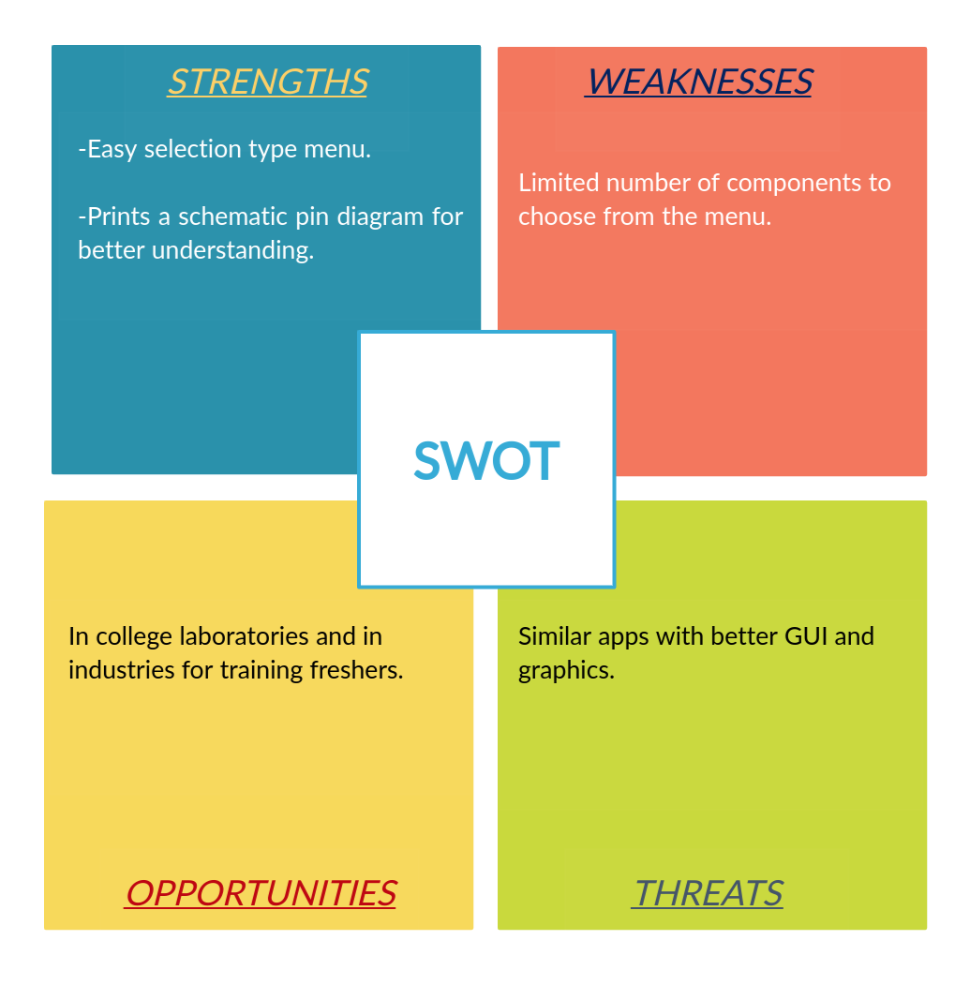

# Requirements
## Introduction
One of the problems faced by an undergraduate student in the laboratory is to find the pin configuration of electronic components. This project aims to help people to easily identify the pin configuration of generally used electronic components.

## Defining Our System
This project consists the pin configuration of commonly used transistors, logic gates, diodes, voltage regulators , MOSFETs and phototransistors.
## SWOT ANALYSIS

# 4W&#39;s and 1&#39;H

## Who:

Helps students as well as others who are finding it difficult to find the pin configurations of components.

## What:

Helps to find pin configuration of many components in a single stop.

## When:

It is useful when someone uses a new component for the first time.

## Where:

Can be of great use for students while they use their labs for the first time.

## How:

Having all the information in single stop helps people to save time and energy.

# Detail requirements
## High Level Requirements:
| ID | Description | Status |
|:-----:|:-----------:|:------:|
|HR01|Print the pin configuration of selected component|Implemented

##  Low level Requirements:
|ID | Description | Status |
|:-----:|:-----------:|:-----:|
LR01|Selecting the category of component as diode, transistor etc.|Implemented
LR02|Selecting the component number in each category|Implemented
LR03|Printing the pin diagram of the selected component with pin number|Implemented
LR04|Printing the details of the component|Implemented